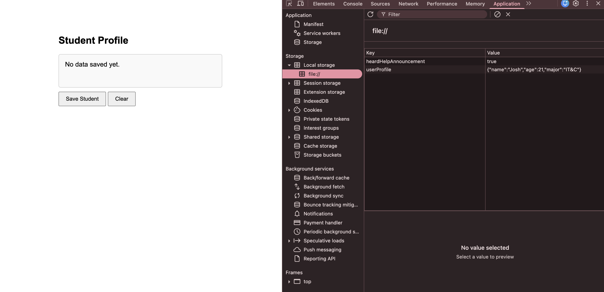
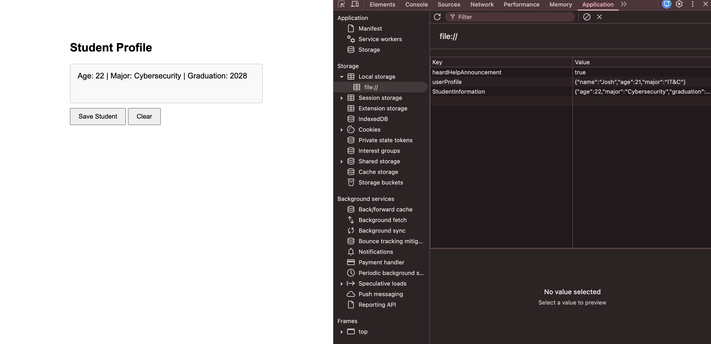

# Writing (210A): Tutorial Blog - JSON

## What is JSON and how is it used?

  JSON is a data format designed to send data between a server and a browser, and allows the developer to organize the data, pairing keys to values in a way that both the developer and computer can easily read. This is the first kind of technology that will be used. The syntax of JSON is also very similar to JavaScript but has strict rules.
  
  The next technology that will be incorporated is calling "localStorage". It is a storage system that is built into every web browser and it lets web browsers store small portions of data onto the user's computer. Every web browser has its own seperate localStorage so as to block a site from accessing the data of another. The storage limit of localStorage is about 5 MB and the data persists even after a browser is closed in contrast to regular variables that disappear when closed, or cookies that have expiration dates. 
  
  The two rely on each other to store, process and handle the data. LocalStorage can only store strings and not arrays or objects, thus it uses JSON to convert those objects into strings. LocalStorage then stores the strings, and gives them back to JSON to revert back to arrays and objects when the browser needs them. JSON makes this process run a lot smoother, as it can convert the complex data in a clean way.

## How it's done

### Set Up

  There is a simple way to get started whether for practice or youre actual project. First you need to open a basic HTML file, some places to do that are VS Code (the one I use), Notepad (Windows), TextEdit (Mac), Sublime Text, or any other similar one. Next, it's important to understand 3 of the common JavaScript methods used to process the JSON data. 
  * First, ```localStorage.setItem()``` sets the data key and value in localStorage. For example:
```
localStorage.setItem("age", 22)
```
sets the value 22 to the key "age". Although local storage only takes strings like I said earlier, Javascript converts it automatically. However when retrieved like in getItem below, it returns it as a string and needs to be converted back to an object. 
  * Next, ```localStorage.getItem``` retrieves the item from localStorage and returns the value that's paired with the key. For example:
```
localStorage.getItem("age")
```
gets the value connected with "age", which in this case is 22.
  * Finally, ```localStorage.removeItem``` deletes a specific value paired with the key from localStorage. For example:
```
localStorage.removeItem("age")
```
would delete 22 from localStorage.

*Tip: You can open browser tools (F12 or right click -> inspect) -> Application tab -> Local Storage, to see immediate changes as you code.*

### *Important Side Note*

Lots of time when coding in JavaScript, data is stored as an object. An example would be:
```
let student = {
  age: 22
  major: "Cybersecurity"
}
```
If you try to save that directly into localStorage like this:
```localStorage.setItem("student", student)```
it won't know how to handle the object, so it will just save it to something like ```[22 Cybersecurity]``` which can't be used for anything. This is why JSON is so useful, because you can use functions like ```JSON.stringify()``` inside of the code above (were the second "age" is) and it will convert it into the proper JSON format as a string string so that it can be stored. Then when you want to retrieve it back from localStorage, you use ```JSON.parse()``` to convert it back to a usable JavaScript object.

### Storing JSON Data

Let's revisit that example of using age, major, and lets add in graduation year, to show how you would save it correctly as JSON data. The object like above would be something like this:
```
let student = {
  age: 22
  major: "Cybersecurity"
  graduation: 2028
}
```
To stringify it (like above) and save it, you simply write:
```
localStorage.setItem("StudentInformation", JSON.stringify(student))
```
Thats it! 
And it will be the same format for getItem and other JavaScript functions, sometimes with other JSON functions like ```JSON.parse()```. In this example, StudentInformation is the key and the stringified object is the value. This key will be used later to find the data later, so vague names like just "data" or "info" can get confusing, especially when using them for multiple things. Also of note that it is best to not include a space when using multiple words, as the program can also treat the space differently and get confused. 

*Note: localStorage has a size limit of about 5 MB, which works just fine for small data, but can get tricky with large files or images.*

### Accessing the JSON Data

The main function used for this is the JavaScript ```getItem()```, which pulls that string back out of localStorage, and uses ```JSON.parse()``` as explained earlier, to revert back to a usable object. Something of note is that if nothing is stored, ```getItem()``` will return ```null``` which can lead to your code crashing so always check! Using an if statement can be a very good method ensuring that it won't return null

When retrieving the data, it is also possible to access each property in the object individually. That is done by including the key name "dot" the property name. Here is an example using the object above:
```
let student = {
  age: 22
  major: "Cybersecurity"
  graduation: 2028
}
let retrieved_data = JSON.parse(localStorage.getItem("StudentInformation")
console.log(retrieved_data.age) // this outputs 22
console.log(retrieve_data.major) // this outputs Cybersecurity
```
Notice how we first set the object of "retrieved_data", and then we use that object to get the specific properties.


###  Displaying the Data on the Page

Displaying the data, requires both HTML, and JavaScript. First, in the HTML, you need to include a paragraph tag ```<p>``` with an ```id``` of something such as the word "display". Next, in your JavaScript, you need to use a function called 
```document.getElementById(<your id>).textContent = <your object>.<your property>```
By doing this, the JavaScript finds the HTML element that has the id, and sets its text to the object property from the localStorage. Another option is to use ```innerHTML``` instead of ```textContent``` which uses element tags inside the string, versus just taking it as a literal string such as "<b>Josh</b>". 

Here are a couple screenshots to show the before and after, when using this function, along with what the local storage looks like. The screenshots are taken before and after clicking the "Save Student" button.



Figure 1: Page before saving data



Figure 2: Page after saving data

*Tip: If you put all of this code inside of function that runs when a page loads, for example ```window.onload```, it will make the data automatically re-appear every time the user visits or refreshes the page, making it easier than having to push a button every time to retrieve their data like in the screenshot examples.*

### Updating and Removing the Data

For the final part of this tutorial, we have the ability to update and remove any of the JSON data. Unfortunately, there's no edit function in JSON, so the way that we do is by retrieving the data, modifying the JavaScript object, stringifying it, and then overwriting the old data with ```setItem```. 

For removing a single item, we do have a function! All you do, is simply use ```localStorage.removeItem(<key name>)```. 

There is also a way to clear everything by using localStorage.clear(), however this one needs to be implemented very carefully. If used wrong, it can wipe ***all*** of the local storage for that site. 

### Sources

Included below are some of the sources that I used to learn about JSON data and write this Tutorial Blog. Take a look at some of them if you'd like!

[MDN - Web Storage API](https://developer.mozilla.org/en-US/docs/Web/API/Web_Storage_API)
This is the official documentation for localStorage. It covers everything from basic usage to more advanced features. I used this as my main reference while writing this tutorial and would recommend it as a go-to resource for any questions about localStorage.

[javascript.info - LocalStorage and Session Storage](https://javascript.info/localstorage)
This is where I started learning about localStorage before writing this. It's very beginner friendly and walks you through everything step by step with clear examples. Good starting point if you're brand new to the concept.

[W3Schools - JSON.stringify()](https://www.w3schools.com/js/js_json_stringify.asp)
A simple and straightforward breakdown of how stringify works with examples you can run directly on the page. Good for quickly understanding the function without a lot of extra reading.

[W3Schools - JSON.parse()](https://www.w3schools.com/js/js_json_sparse.asp)
Same as above but for parse. I'd recommend reading both of these W3Schools pages together since stringify and parse are always used alongside each other.

[Turing School — JSON and localStorage](https://frontend.turing.edu/lessons/module-1/json-and-localstorage.html)
A shorter read that gives a clean overview of how JSON and localStorage work together. Good if you want a second explanation of the core concept after reading the others.


